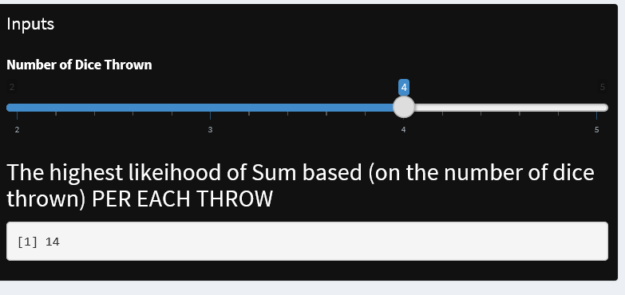
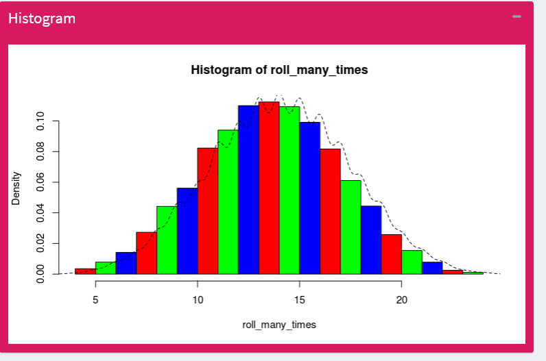

## Introduction

Playing Dices is simple in Casino. All we need is to guess the SUM per throw and bet accordingly. You can try this at home on a paper too.

If we have 2 fair dices, what is the statistical frequency of a sum of 2 (1+1) or sum of 3 (1+2) or sum of 8 (4+4, 3+5, 2+6) per EACH throw respectively ? We are looking at the DIGITS. What if casino have games of 3 dices or 4 dices or 5 dices ? The SUM of each throw will raise exponetially for many dices.

Here we are predicting the likelihood or high frequency of a certain SUM to appear when x number of dices were thrown EACH TIME. Since we cannot control LUCK, the only variable to pit against the casino is using probability.

We will be using simple URL [https://jkklim.shinyapps.io/casino](https://jkklim.shinyapps.io/casino "Casino URL") to illustrate the statistics.

Application Caveat:

The application rolls the dice for 10000 times and average the mean for every roll sums. Each roll is independent in real-life. Here we are assuming if the gambler watch the games for 10000 times and bet the mean along with TIME.


--- .class #id 


## Input Screen Shot

Here is the input screen. You can slide from 2 dices to 5 dices. Each time the slide number changes, the SUM of the most frequent number per throw each time appears. 

This means if you stay long (24 hours) enough or roll the dice 10000 times in a casino watching the same game, the sum is the highest frequency it will statistically generated by the dice.




--- .class #3

## Histogram

Here you can see the histogram with its graphical frequency when the input slider changes.




--- .class #4

## The R code

```
roll <-function() 
{
  die<- 1:6
  dice<-(sample(die,size=3, replace=TRUE, prob=c(1/6,1/6,1/6,1/6,1/6,1/6)))
  sum(dice)
}

roll_many_times <- replicate(10000,roll())

library(ggplot2)
hist(roll_many_times, freq=FALSE, col=rainbow(3))
lines(density(roll_many_times), lty=2)
round(mean(roll_many_times),0)
```
